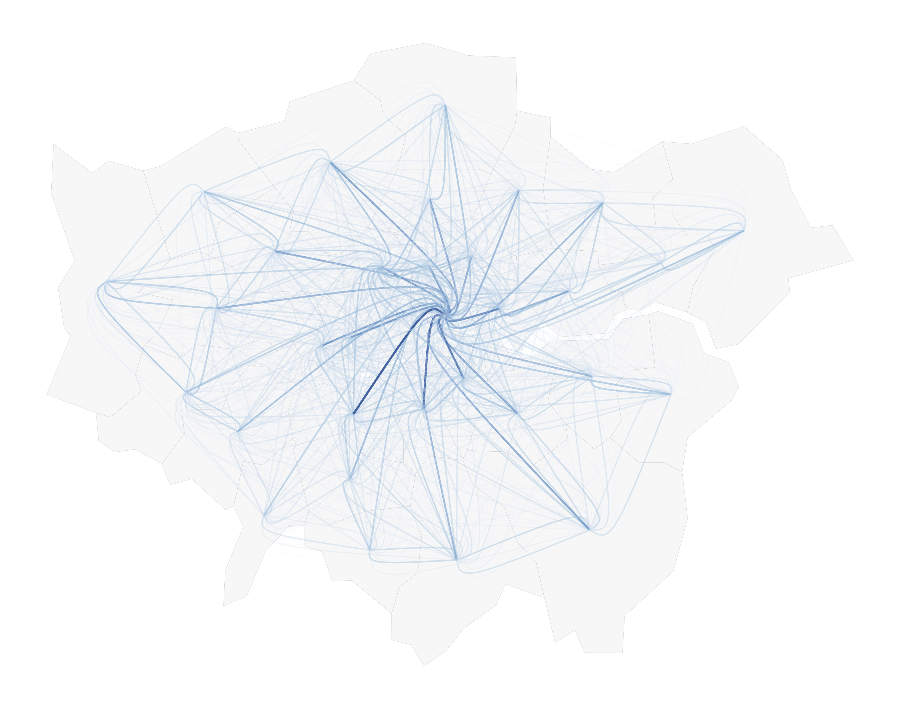
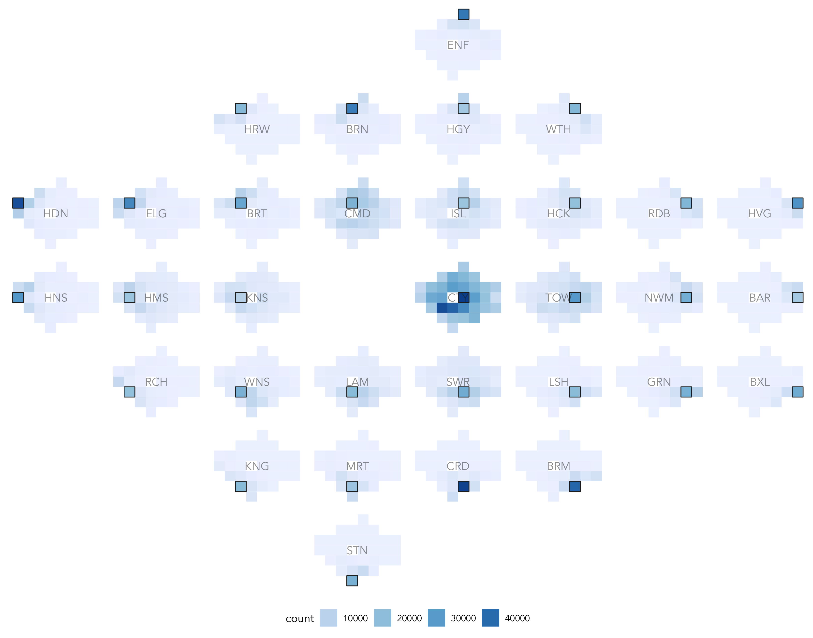
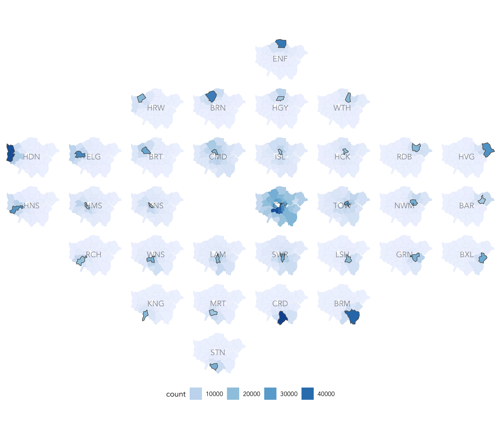

## Upgrading spatial analysis of Origin-Destination data using modern visualization frameworks

* [Roger Beecham](http://www.roger-beecham.com) |  [@rjbeecham](https://twitter.com/rJBeecham)

Below are reproducible code examples supporting [this blog post](https://medium.com/@roger.beecham.231/upgrading-spatial-analysis-of-origin-destination-data-using-modern-vis-frameworks-part-1-of-2-ee1c6481a595) for generating flow maps with asymmetric Bezier curves and spatially-ordered OD matrices in _ggplot2_.


## Configure R

In addition to [tidyverse](https://cran.r-project.org/web/packages/tidyverse/index.html) and [simple features](https://cran.r-project.org/web/packages/sf/index.html), these examples depend on the _ggplot2_ extension [_ggforce_](https://cran.r-project.org/web/packages/ggforce/index.html) and the  development version of _ggplot2_, downloaded via `devtools::install_github("tidyverse/ggplot2")`.

```{r libraries, eval=FALSE}
# Bundle of packages supporting Tidy data analysis.
library(tidyverse)
# For working with geometries.
library(sf)
# For simplifying geometries.
library(rmapshaper)
# ggplot2 extension for Beziers.
library(ggforce)
# Dev version of ggplot2 required for combining ggplot2 with sf data. 
#devtools::install_github("tidyverse/ggplot2")
library(ggplot2)
# Set default  ggplot2 theme.
theme_set(theme_minimal())
```


## Collect Data

2011 Census OD travel-to-work data are freely available via [nomisweb](https://www.nomisweb.co.uk) to Local Authority District (LAD) level. However, these are historical authorities where City of London and Westminster are merged. Clearly this is not ideal for studying commuting patterns in London. The Medium post is based originally on data collected at a finer resolution which are then aggregated to LAD-level. These data are published via [UK Data Service](https://census.ukdataservice.ac.uk) and available only to registered users. This repository is based on the freely available data from [nomisweb](https://www.nomisweb.co.uk) with the merged data represented at City of London.

```{r data, eval=FALSE}
# Read in data.
# Travel to work data downloaded from nomisweb.
# Full query and metadata can be viewed from: https://www.nomisweb.co.uk/query/asv2htm.aspx.
data <- read_tsv("http://homepages.see.leeds.ac.uk/~georjb/datasets/od_ttw.tsv")
codes <- read_tsv("http://homepages.see.leeds.ac.uk/~georjb/datasets/od_ttw_codes.tsv")
# nomisweb uses merged City of London and Westminster definition.
# Rename to single LAD (City of London). 
codes <- codes %>% mutate(description_lookup=if_else(description=="Westminster,City of London","City of London", description))
london_squared <- read_csv("http://homepages.see.leeds.ac.uk/~georjb/datasets/london_squared.csv") 

# Helper function for rescaling
map_scale <- function(value, min1, max1, min2, max2) {
  return  (min2+(max2-min2)*((value-min1)/(max1-min1)))
}
# Used to reverse london_squared layout for use in ggplot2 facet_grid().
max_y <- max(london_squared$fY)
min_y <- min(london_squared$fY)
london_squared <- london_squared %>% mutate(fY=map_scale(fY, min_y, max_y, max_y, min_y))
rm(min_y,max_y)

# nomisweb's merged LAD codes are different to those used more widely and by ONS Open Geography. 
# We need to match using LAD name.
# Get a region lookup from ONS Open Geography.
region_lookup <- st_read("https://opendata.arcgis.com/datasets/c457af6314f24b20bb5de8fe41e05898_0.geojson")
# Remove geometry data.
st_geometry(region_lookup) <- NULL
# Join on name. 
region_lookup <- region_lookup %>% filter(RGN17NM=="London") %>% 
  left_join(codes,by=c("LAD17NM"="description_lookup")) %>%
  rename("ladcd"="LAD17CD", "ladnm"="LAD17NM") %>% 
  select(ladcd, ladnm, geogcode, description)

# Update OD data with codes representing origins and destinations.
# Standardise variable labelling and values and create a unique od_pair variable.
data <- data %>% 
  rename("home_code"="geogcode", "d_name"="place of work", "count"="value", "mode"="Method of travel to wor") %>%
  mutate(d_name=gsub("\\{place of work}", "", d_name),
         mode=gsub("\\:.*$","",mode),
         mode=recode_factor(mode, "All categories"="all", "Bicycle"="bike", "On foot"="foot")) %>%
  # Join on work_name and description.
  left_join(region_lookup %>% select(description, ladcd), by=c("d_name"="description")) %>%
  rename("d_code"="ladcd") %>%
  # Join on home_code and geogcode.
  left_join(region_lookup %>% select(geogcode, description, ladcd), by=c("home_code"="geogcode")) %>%
  rename("o_code"="ladcd", "o_name"="description") %>%
  select(mode, o_name, o_code, d_name, d_code, count) %>% 
  mutate(od_pair=paste(o_name, d_name, sep="-"))

# Read in shapefile containing GB LA boundaries -- made available from ONS Open Geography Portal. 
# We simplify the geometries using the "rmapshaper" library.
download.file("http://geoportal.statistics.gov.uk/datasets/8edafbe3276d4b56aec60991cbddda50_3.zip", "boundaries_gb.zip")
unzip("boundaries_gb.zip")
gb_boundaries <- read_sf("Local_Authority_Districts_December_2015_Super_Generalised_Clipped_Boundaries_in_Great_Britain.shp")
# Set CRS to OSGB.
gb_boundaries <- st_transform(gb_boundaries, crs=27700)
# Inner_join with region_lookup data to also filter London LADs.
london_boundaries <- gb_boundaries %>%
  inner_join(region_lookup %>% select(ladcd), by=c("lad15cd"="ladcd")) 
rm(gb_boundaries)
# Simplify polygon.
london_boundaries <- ms_simplify(london_boundaries, keep=0.2)
# Clean workspace.
rm(codes, region_lookup)
```


## Draw asymmetric Beziers between OD pairs

In order to generate the Bezier curves, we need to calculate centroids for each London borough. We then build a data frame of coordinates representing origins, destinations and control points of our Beziers. These are specified following the method published in [Wood et al. 2011](http://openaccess.city.ac.uk/538/).  For brevity, I have encapsulated these functions into a script.

```{r lines-data, eval=FALSE}
# Calculate centroids for Beziers.
london_centroids <- london_boundaries %>%
  st_centroid() %>%
  st_coordinates() %>%
  as_tibble() %>%
  rename("east"="X", "north"="Y") %>%
  add_column(ladcd=london_boundaries %>% pull(lad15cd))
# Add centroids to OD data.
data <- data %>% 
  left_join(london_centroids, by=c("o_code"="ladcd")) %>% rename("o_east"="east", "o_north"="north") %>% 
  left_join(london_centroids, by=c("d_code"="ladcd")) %>% rename("d_east"="east", "d_north"="north")

# Functions for determining coords and control points.
source("./src/bezier_path.R")

# Build data frame of trajectories (OD pair with controls).
od_trajectories <- bind_rows(data %>% filter(o_code!=d_code) %>% pull(od_pair) %>% unique %>%
                               purrr::map_df(~get_trajectory(data %>% filter(od_pair==.x))) 
                               )

```

The _ggplot2_ specification is reasonably straight-forward, but note that it depends on `geom_sf()`, available only in the development version of _ggplot2_. We create a variable representing OD-pair frequency `f_od`, which is used to determine the visual saliency of flow lines (again this appears in [Wood et al. 2011](http://openaccess.city.ac.uk/538/)).  We can  semi-automate this parameterisation of exponent that we use to vary this weighting using `dplyr` mutate before the _ggplot2_ specification call; the smaller the exponent, the less strong the frequency weighting effect (currently set to `^0.4`).

```{r lines-vis, eval=FALSE}
# ggplot2 specification for OD flow map from trajectories.
od_trajectories <- od_trajectories %>% mutate(f_od=((count/max(count))^0.4))
ggplot()+
  geom_sf(data=london_boundaries,  fill="#f7f7f7", colour="#cccccc", size=0.1)+
  coord_sf(crs=st_crs(london_boundaries), datum=NA)+
  geom_bezier0(aes(x=x, y=y, group=od_pair, alpha=f_od, colour=f_od, size=f_od), data=od_trajectories)+
  scale_alpha_continuous(range=c(0.1,0.9))+
  scale_size_continuous(range=c(0.1,0.9))+
  guides(colour=FALSE, alpha=FALSE, size=FALSE)+
  scale_colour_distiller(palette="Blues", direction=1)+
  theme(axis.title=element_blank())

```



## Spatially ordered OD matrix

We first update our OD data with the [aftertheflood](https://aftertheflood.com/projects/future-cities-catapult/) borough positions.

```{r matrix-data, eval=FALSE}
# Add aftertheflood layout to centroids df.
london_centroids <- london_centroids %>% add_column(ladnm=london_boundaries %>% pull(lad15nm)) %>% 
  left_join(london_squared, by=c("ladnm"="authority"))

# Update OD data with london_squared positions (fX fY) for origin and destination.
data <- data %>% 
  left_join(london_centroids %>% select(ladcd, fX, fY, BOR), by=c("o_code"="ladcd")) %>% 
  rename("o_fX"="fX", "o_fY"="fY", "o_bor"="BOR") %>%
  left_join(london_centroids %>% select(ladcd, fX, fY, BOR), by=c("d_code"="ladcd")) %>% 
  rename("d_fX"="fX", "d_fY"="fY", "d_bor"="BOR")
```

We make use of `geom_tile()` for the matrix of origins, and `geom_facet()` for the matrix of larger destination cells. 

```{r matrix-vis, eval=FALSE}
# Identify borough in focus (edit this to switch between D-OD and O-DO matrix).
data <- data %>% mutate(bor_label=if_else(o_bor==d_bor,d_bor,""),bor_focus=if_else(o_bor==d_bor,1,0))
# Spatially-ordered OD matrix.
data %>%
  ggplot(aes(x=o_fX, y=-o_fY)) +
  geom_tile(aes(fill=count))+
  geom_tile(data=data  %>% filter(bor_focus==1), fill="transparent", colour="#252525", size=0.4)+
  geom_text(aes(4.5, -4, label=bor_label, hjust="middle", vjust="middle"), colour="#252525", alpha=0.5)+
  scale_fill_distiller(palette="Blues", direction=1, guide=guide_legend())+
  scale_colour_manual(values=focus_colours)+
  facet_grid(d_fY~d_fX, shrink=FALSE, scales = "free_x")+
  theme( 
    legend.position="bottom",
    axis.title = element_blank(),
    axis.ticks = element_blank(),
    axis.text = element_blank(),
    axis.line = element_blank(),
    panel.grid=element_blank(),
    strip.text=element_blank()
  )
```



# Spatially-ordered choropleths


We need to attach geometries to our dataset of OD pairs.

```{r chropleths-data, eval=FALSE}
# Calculate centre of London for placement of borough labels.
temp <- london_boundaries %>%
  add_column(temp_id="Lon") %>%
  group_by(temp_id) %>%
  summarise() %>%
  st_centroid() %>%
  st_coordinates() %>%
  as_tibble() %>%
  rename("lon_east"="X", "lon_north"="Y") 
# Add to london_boundaries.
london_boundaries <- london_boundaries %>%
  mutate(lon_east=temp$lon_east, lon_north=temp$lon_north)
rm(temp)
# Generate a df to plot with geometries attached to od data.
plot_data <- london_boundaries %>% 
  right_join(data, by=c("lad15cd"="o_code"))
```

`geom_sf()` creates the choropleths; `facet_grid()` splits the choropleths and arranges them at their approximate spatial position.

```{r chropleths-vis, eval=FALSE}
# Spatially-ordered OD choropleths.
ggplot()+
  geom_sf(data=plot_data, aes(fill=count), colour="#636363", size=0.01)+
  geom_sf(data=plot_data  %>% filter(bor_focus==1), fill="transparent",  colour="#636363", size=0.4)+
  geom_text(data=plot_data, aes(x=lon_east, y=lon_north, label=bor_label), colour="#252525", alpha=0.5, show.legend=FALSE)+
  coord_sf(crs=st_crs(plot_data), datum=NA)+
  scale_fill_distiller(palette="Blues", direction=1, guide=guide_legend())+
  facet_grid(d_fY~d_fX, shrink=FALSE)+
  theme(
    legend.position="bottom",
    axis.title=element_blank(),
    strip.text=element_blank())
```

